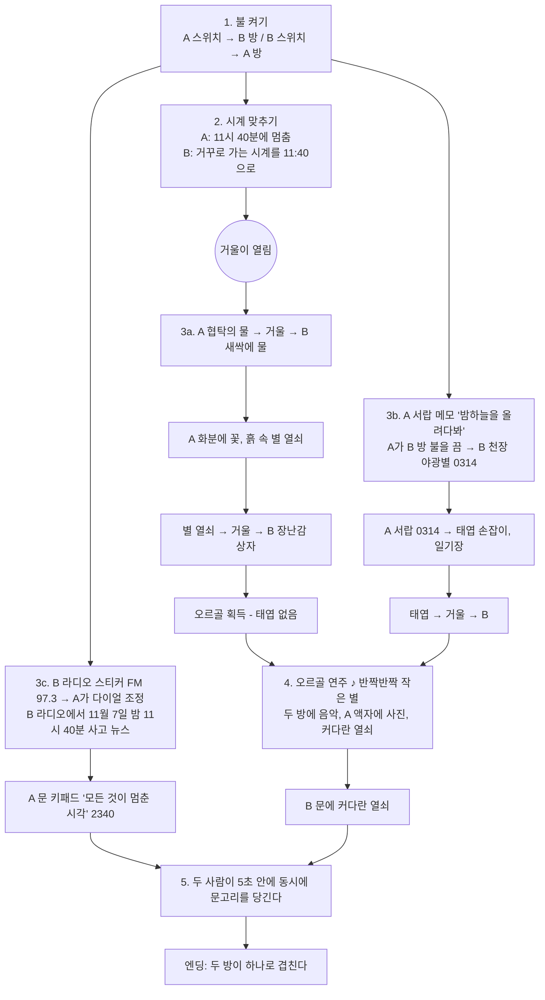

# 맞은편 — 기획 문서 (스포일러 주의)

## 한 줄 요약

두 사람이 서로 다른 방에 갇혀 벽 너머로 대화하며 탈출한다.
알고 보니 두 방은 **같은 방**이었고, 두 사람은 **한 사람의 두 마음**이었다.

## 시놉시스

**한서진**(30대)은 11월 7일 밤 11시 40분, 엄마 생신 케이크를 싣고 빗길을 달리다 사고를 당해 의식을 잃는다.
그날 이후 서진의 마음은 둘로 나뉜다.

| | 새벽의 방 (플레이어 A) | 노을의 방 (플레이어 B) |
| --- | --- | --- |
| 정체 | 어른 서진 — 모든 걸 잊고 떠나고 싶은 마음 | 어린 서진, "별이" — 따뜻한 기억 속에 머물고 싶은 마음 |
| 시간 | 새벽 4시의 푸른빛, 비 온 뒤 | 해 질 녘 주황빛 |
| 방의 모습 | 정리된 책상, 빈 액자, 떼어낸 야광별 자국, "버릴 것" 상자 | 야광별 천장, 장난감 상자, 크레파스 그림, 토끼 인형 |
| 말투 | 담담한 어른의 문장 | 짧고 들뜬 아이의 문장 |
| 눈높이 | 1.62m | 1.18m (아이 키) |

두 사람은 서로가 옆방의 모르는 사람이라고 생각한 채로 협력한다.
두 방은 치수와 가구 배치가 완전히 같아서, 서로의 방을 설명하다 보면 "우리 방이랑 구조가 똑같은데?" 하는 순간이 온다.

## 핵심 규칙 — 서로의 방에 영향을 준다

- **전등 스위치**는 내 방이 아니라 맞은편 방의 불을 켜고 끈다.
- **거울**은 시계를 맞춘 뒤부터 물건을 맞은편으로 건네는 통로가 된다.
- **라디오**: 새벽의 방 라디오는 다이얼만 돌아가고 소리가 안 나며, 소리는 노을의 방 라디오에서 나온다.
- **화분**: 노을의 방(과거)에서 새싹에 물을 주면, 새벽의 방(현재)의 죽은 화분에서 꽃이 핀다.
- **오르골** 소리는 두 방 모두에 들리고, 새벽의 방 빈 액자에 사진이 떠오른다.
- **문**: 두 문은 사실 같은 문이다. 한쪽 자물쇠를 풀면 반대쪽에서 "철컥" 소리가 들린다.

## 퍼즐 흐름

### 정답표

| 단계 | 누가 | 정답 / 행동 | 단서의 위치 |
| --- | --- | --- | --- |
| 불 | 둘 다 | 서로의 스위치를 누른다 | 어둠 속에서 빛나는 스위치 |
| 시계 | B | 11시 40분으로 맞춘다 | A의 멈춘 시계 |
| 물 | A → B | 협탁의 물을 거울로 보내 B가 새싹에 준다 | B "물이 없다", A "이 화분은 너무 늦었다" |
| 별 열쇠 | A → B | A 화분에서 나온 열쇠로 B 장난감 상자 | B 상자의 별 모양 열쇠 구멍 |
| 서랍 | A | **0314** | B 천장 야광별 (B 방이 어두울 때만 보임 → A가 불을 꺼줘야 함) |
| 오르골 | A → B | 태엽 손잡이 + 오르골 조합 | 오르골 설명 "태엽 손잡이가 빠져 있다" |
| 라디오 | B → A | A가 **97.3MHz**로 맞춘다 | B 라디오 뒷면 스티커 |
| 새벽의 문 | A | **2340** (1140은 오답 — "오전이었을까, 밤이었을까?") | 멈춘 시계 + 뉴스의 "밤 11시 40분" |
| 노을의 문 | B | 커다란 열쇠 | 오르골 바닥에서 나옴 |
| 탈출 | 둘 다 | 5초 안에 함께 문고리를 당긴다 | "하나, 둘, 셋!" |

## 복선 (플레이어가 눈치챌 수 있는 것들)

1. 두 방의 가구 배치가 똑같다.
2. 새벽의 방 천장에는 별 모양 **끈끈한 자국**, 노을의 방 천장에는 **야광별**.
3. 새벽의 방 "버릴 것" 상자 안에 몽당 크레파스와 빛을 잃은 별 스티커.
4. 새벽의 방 책장 맨 아래 칸의 **빈자리** ↔ 노을의 방 책장 맨 아래 칸의 "내가 제일 좋아하는 책들".
5. 거울 속: A에게는 **아이**가, B에게는 **어른**이 비친다. 거울은 맞은편 방의 빛깔로 일렁인다.
6. A의 일기: "천장에 붙어 있던 야광별을 전부 떼어냈다." ↔ B의 그림일기: "엄마랑 천장에 야광별을 붙였다. 내 생일 숫자 모양으로!"
7. 오르골 노래를 A도 따라 부를 줄 안다.
8. 새벽의 방 액자에 떠오르는 사진과 노을의 방 가족사진이 **같은 사진**.
9. A의 약봉투·일기장에는 "서진", B의 토끼 인형 이름표와 A 액자에 떠오른 사진 뒷면에는 "별이".
10. 크레파스 그림: 키 큰 사람과 작은 아이가 손을 잡고 "나중에 꼭 만나자!"

## 엔딩

1. 각자의 시점: 문을 열자 복도가 아니라 **상대의 방**이 있다. A는 작은 아이를, B는 어른을 본다.
2. 상대의 방을 카메라가 천천히 비춘다.
3. 두 방이 반씩 합쳐졌다가 하나로 겹친다. 거울 속에 아이와 어른의 실루엣이 함께 선다.
   — "두 개의 방은, 처음부터 하나의 방이었다."
4. 진실: 한서진의 방, 11월 7일 밤 11시 40분, 둘로 나뉜 마음. "별이"는 엄마만 부르던 서진의 어릴 적 이름.
5. 에필로그: 병원. "서진아, 엄마 목소리 들려?" — "…엄마. 생일 축하해."
6. 크레딧: 두 플레이어의 닉네임, 탈출 시간, 힌트 사용 횟수.

## 확장 아이디어

- 챕터 2: 병원에서 깨어난 뒤, 이번엔 엄마의 기억 속으로.
- 음성 채팅(WebRTC) 연결.
- 플레이 기록 랭킹(탈출 시간).
- 방 안의 물건을 들어 올려 돌려보는 확대 보기.
